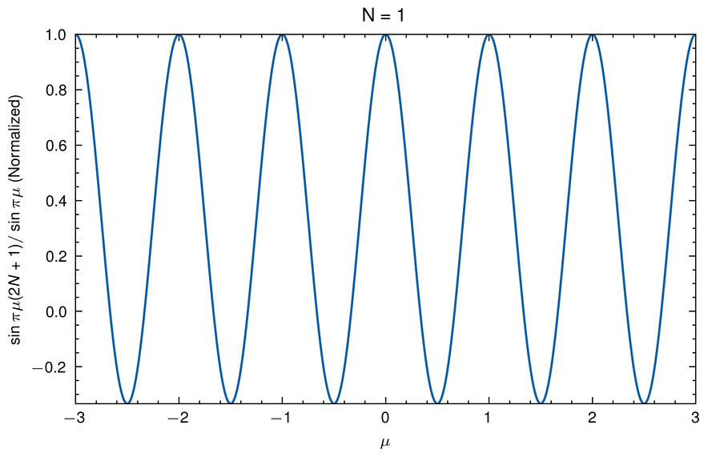

# Incompleteness & Poisson summation formula

## Description

- Poisson summation formula is given as
  ```math
  \sum_{n=-N}^{n=N}e^{2\pi i \mu N} = \frac{\sin \pi \mu (2N + 1)}{\sin \pi \mu}
  ```

- In this repository, we will visualize the summation formula for different values of `N`

## Results


